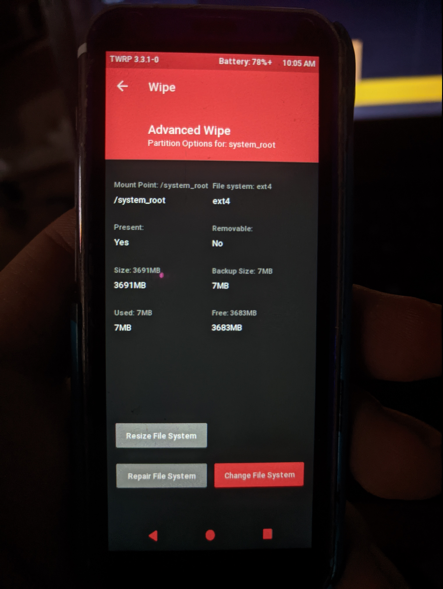

# K-TOUCH i9 | Reparticionado



1.- Descarga el binary de Parted de abajo según tu Arquitectur (en el caso del i9 es ARM64)

<b>```Parted ARM```:<a href="https://github.com/daviiid99/K-Touch_i9/raw/Parted-GUIDE/Binaries/parted_ARM.zip">Descarga</a></b>

<b>```Parted ARM64```:<a href="https://github.com/daviiid99/K-Touch_i9/raw/Parted-GUIDE/Binaries/parted_ARM64.zip">Descarga</a></b>
<br/>
<br/>
2.- Bootea el teléfono a TWRP, para esta guía usaremos <b><a href="https://github.com/daviiid99/K-Touch_i9/raw/Parted-GUIDE/Binaries/parted_recovery.img">esta compilación</a></b>
<br/>

3.- Descomprime el archivo parted en una ruta, abre el terminal, conecta el teléfono por USB y escribe lo siguientes:
```
adb push parted /sbin
adb push mkfs.ext4 /sbin
adb shell
```
<br/>

4.- Aparecerá un log de bienvenida de parted, ahora escribe:
```
chmod 777 /sbin/parted
chmod 777 /sbin/mkfs.ext4
parted /dev/block/mmcblk0
```
<br/>

5.- Escribe lo siguiente para listar las particiones:
```
print
```

Tomaremos esta imagen como referencia, una similar aparecerá en tu terminal.
En esta guía vamos a aumentar la partición /system, sí que nos fijamos que número ocupa y borramos también la partición /userdata y /cache
(En tu terminal los números de las particiones a los que hacen referencia pueden ser diferentes, así que debes cambiarlos según tu tabla)

En el caso de este i9, sería:
```
rm 31
rm 32
rm 33
```
<br/>

6.- Teniendo las particiones borradas, es hora de crearlas.
Para crear las nuevas particiones, ya que queremos ampliar la stock, debemos escoger un inicio adecuado y un final que queramos.

Por ejemplo:
En el caso de mi i9, la partición anterior al /system borrado es el /vendor, el vendor tiene dos valores; start(352MB) y end (1636MB), la resta de ambos da el size que es 1283MB.
Para crear las nuevas particiones, ahora el /system, debemos fijarnos en el valor end de la partición anterior, que a su vez es la suma de sus valores start y size

En el caso del i9 para aumentar el /system hasta las 4GB sería:
```
mkpart system ext4 1636 5636
```

Repetimos el mismo paso para volver a crear el /cache y el /userdata con el espacio restante:
```
mkpart cache ext4 5636 5836
mkpart userdata ext4 5836 15000
```

Y el resultado de las particiones al hacer ```print``` sería el siguiente:

<br/>

7.- Una vez creadas las particiones, es hora de nombrarlas. Fíjate en el print en que numero ocupa cada tamaño y llámalas segun corresponda.
En el i9 sería:
```
name 31 system
name 32 cache
name 33 userdata
```
<br/>

8.- Ahora hay que asignarle a las particiones su flag original, haz lo mismo cambiando el número por el que corresponda en tus particiones.
En el i9 sería:
```
set 31 msftdata on 
set 32 msftdata on
set 33 msftdata on 
```
<br/>

9.- Escribe ```quit``` para salir de Parted. Ya está reparticionado
<br/>

10- Reinicia TWRP, ve al menú ```Wipe> system,data,cache>File system options>Change file system>EXT2>EXT4```
  Y repite ese paso con cada una de las particiones reparticionadas hasta que muestren su nuevo tamaño.
  <br/>
  
11.- Ya puede instalar ROMs/GSis que necesiten más espacio.
